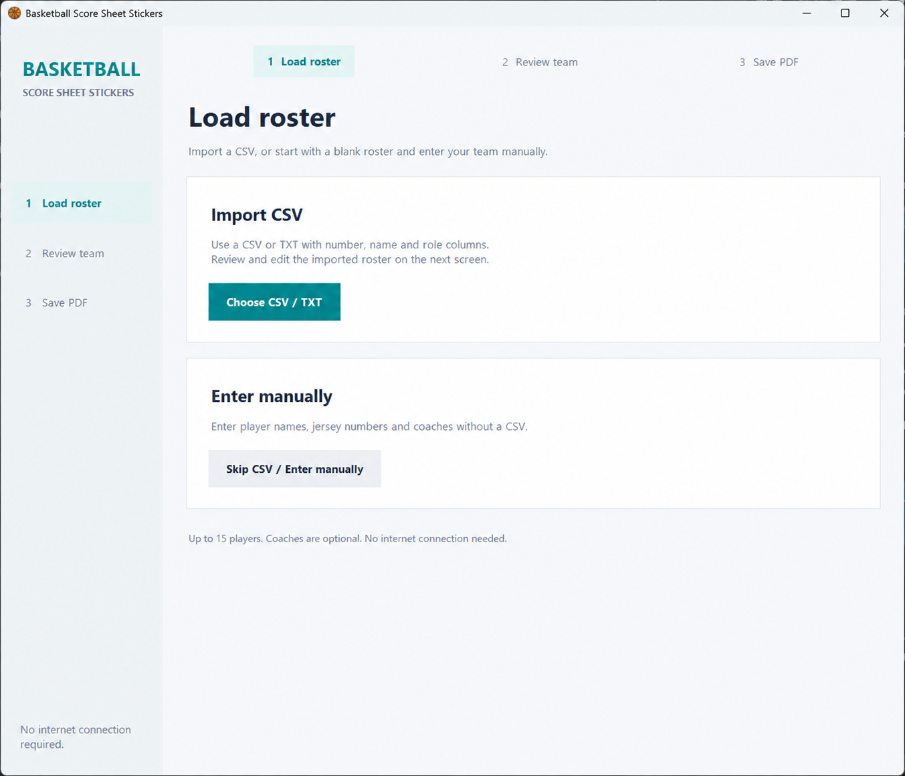
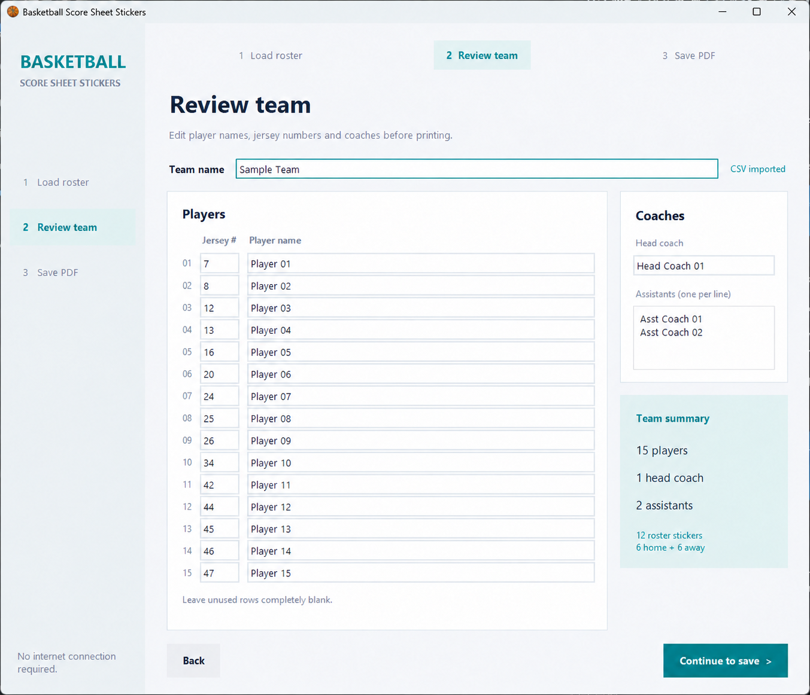
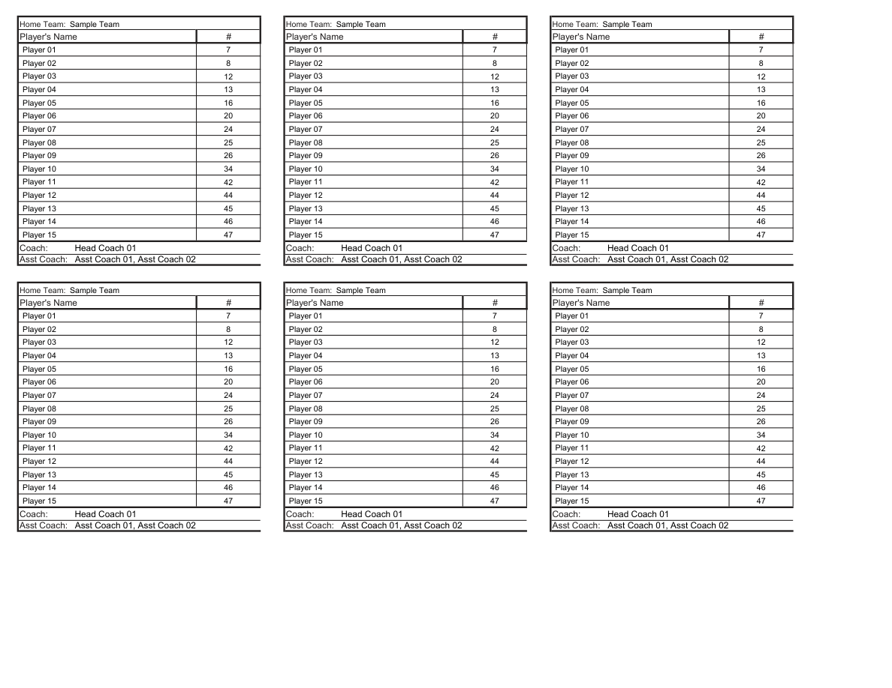

# Basketball Score Sheet Stickers

Printable basketball score sheet roster stickers, prepared for the 2026 season. The stickers let scorekeepers add the team name, player names, jersey numbers, and coaching staff to a score sheet without handwriting the roster for every game.

The current artwork uses **Sample Team** and obvious placeholders for player and coach names, with separate home and away roster layouts.

## Download and screenshots

Download the [Windows package from Releases](https://github.com/cpetersen4/basketball-score-sheet-stickers/releases/latest), extract the ZIP, and run `Basketball-Score-Sheet-Stickers.exe`. It includes the standalone app, fictional sample roster, and [illustrated PDF manual](docs/Basketball-Score-Sheet-Stickers-Manual.pdf).

No Python or Illustrator installation is required. The EXE bundles its libraries and PDF template, works offline, and uses Windows Arial. A PDF viewer is needed to view or print the result. Designed for Windows 10/11 x64; tested on Windows 11. The executable is unsigned.

### Load a CSV or enter a roster manually



### Review up to 15 players and coaching staff



### Print the home and away score sheet stickers



## Files

| File | Purpose |
| --- | --- |
| [templates/score-sheet-stickers-2026.ai](templates/score-sheet-stickers-2026.ai) | Editable Adobe Illustrator artwork. |
| [templates/score-sheet-stickers-2026.pdf](templates/score-sheet-stickers-2026.pdf) | Printable PDF containing repeated home and away roster stickers. |

## Printing and use

1. Use **full-sheet 8.5 × 11-inch adhesive label paper**, such as [this label paper](https://a.co/d/0fz6G47o) or Staples full-sheet shipping label paper. Choose paper suitable for your printer, with one label covering the whole sheet.
2. Open the generated PDF and select the home or away page as needed.
3. Select **Letter (8.5 × 11 inches)** paper and **Actual size / 100%** in the print dialog. Do **not** select Fit, Shrink, or Scale to fit. The PDF pages are landscape.
4. Check a plain-paper test print against the score sheet, then print on the label paper.
5. Use a **straight paper cutter or scissors** to cut out the individual stickers. Peel off the backing and attach each sticker to the team roster area on the score sheet.

## Updating the artwork

Open the `.ai` file in Adobe Illustrator to change the team name, roster, jersey numbers, or coaches. Keep the layout aligned with the reference score sheet, update each repeated sticker, and export a new PDF for printing. Check the export at actual size before use.

The artwork can be edited in Illustrator. The PDF generator below works independently of Illustrator.

## Obfuscating names

Run `tools/obfuscate-names.jsx` in Illustrator through **File > Scripts > Other Script**. The script reads a roster CSV with `number,name,role` columns to identify the original names and replaces them with `Player 01`, `Head Coach 01`, and `Asst Coach 01` placeholders. It saves the Illustrator file in `templates/` and places a backup in the Windows temporary folder.

Create a folder under `teams/` for each real team. These folders are ignored by Git; only the instructions and fictional `sample/` folder are tracked.

## Generate stickers from a roster

### Windows app (no installation required)

Extract `Basketball-Score-Sheet-Stickers-Windows-x64.zip` and double-click `Basketball-Score-Sheet-Stickers.exe`. The guided interface has three steps:

1. **Load roster:** import a CSV / TXT, or choose **Skip CSV / Enter manually** to start with an empty roster.
2. **Review team:** enter or edit the team name, jersey numbers, player names and coaches. Enter assistant coaches one per line. The team summary updates as you type.
3. **Save PDF:** choose a new output filename, create the printable PDF, then use **Open saved PDF** to print it.

Click any step at the top, or use **Back**, to switch screens; entered values and the output path are preserved. **Save PDF** validates the roster before opening. Both imported and manually entered rosters receive the same validation. On smaller screens, scroll the form to reach all 15 rows; tabbing to a field brings it into view. Navigation buttons remain visible.

The standalone app targets 64-bit Windows 10/11. It bundles Python, its PDF dependency, and the template. It uses the standard Windows Arial font and works offline; Illustrator is not needed.

### Roster format

An obfuscated copy of the original roster is available at [teams/sample/team-names_sample.csv](teams/sample/team-names_sample.csv). It preserves the original jersey numbers and roles while replacing every player and coach name.

```csv
number,name,role
7,Example Player,Player
na,Example Head Coach,Head Coach
na,Example Assistant,Assistant Coach
```

Save as UTF-8 `.csv` or `.txt`. Roles are `Player`, `Head Coach`, and `Assistant Coach`. Names containing commas must be quoted. Coach rows are optional; at most one head coach is supported. Player order follows the CSV. There are 15 player slots; unused slots and numbers are cleared. Names shrink to fit their cells, with an error if they would become too small to read. The app refuses duplicate jersey numbers, unsupported roles, and invalid templates.

Both pages retain their six stickers and original physical dimensions. Generated PDFs should be printed at **actual size**. The original template and any existing output file are never overwritten. Keep rosters and generated PDFs together in an ignored team folder; see [teams/README.md](teams/README.md). When importing a CSV, the Save dialog starts in its folder.

### Python script

For developers with Python 3.10 or newer on Windows:

```powershell
python -m pip install -r tools/requirements.txt
python app/generate_pdf.py teams/sample/team-names_sample.csv output/sample-stickers.pdf --team "Sample Team"
```

Run `python app/generate_pdf.py` without arguments to open the GUI. Use `--template` to select another PDF exported with the same placeholder structure. The included two-page template is selected by default.

### Build the Windows executable

On a 64-bit Windows PC with Python 3.10 or newer:

```powershell
powershell -ExecutionPolicy Bypass -File tools/build-windows.ps1
```

The build creates the standalone EXE and a ZIP with an obfuscated sample roster and quick-start instructions under `dist/`. Build outputs are ignored by Git. The build uses an isolated environment under `build/venv/`, embeds the basketball icon, and packages the PDF manual instead of a text quick-start.

Run the generator tests with `python -m unittest discover -s tests -v`.

To regenerate the manual after updating screenshots, install `reportlab` in a developer environment and run `python tools/create_manual.py`.

Release checks are recorded in [docs/SECURITY-CHECKS.md](docs/SECURITY-CHECKS.md). Verify an extracted Windows package with `python tools/verify_windows_package.py` after building.

## License

Free for personal, noncommercial use, including preparing score sheets for your team. Redistribution, publishing copies, resale, and commercial exploitation require the owner's prior written permission. Private installation copies and backups are allowed. See [LICENSE](LICENSE).

You may print and share generated score sheets for your team's scorekeeping. Third-party libraries retain their own permissive licenses; see [THIRD-PARTY-NOTICES.md](THIRD-PARTY-NOTICES.md). The original score sheet reference embedded in the Illustrator artwork retains its original ownership. This app is independently developed and does not claim affiliation with the score sheet publisher.
